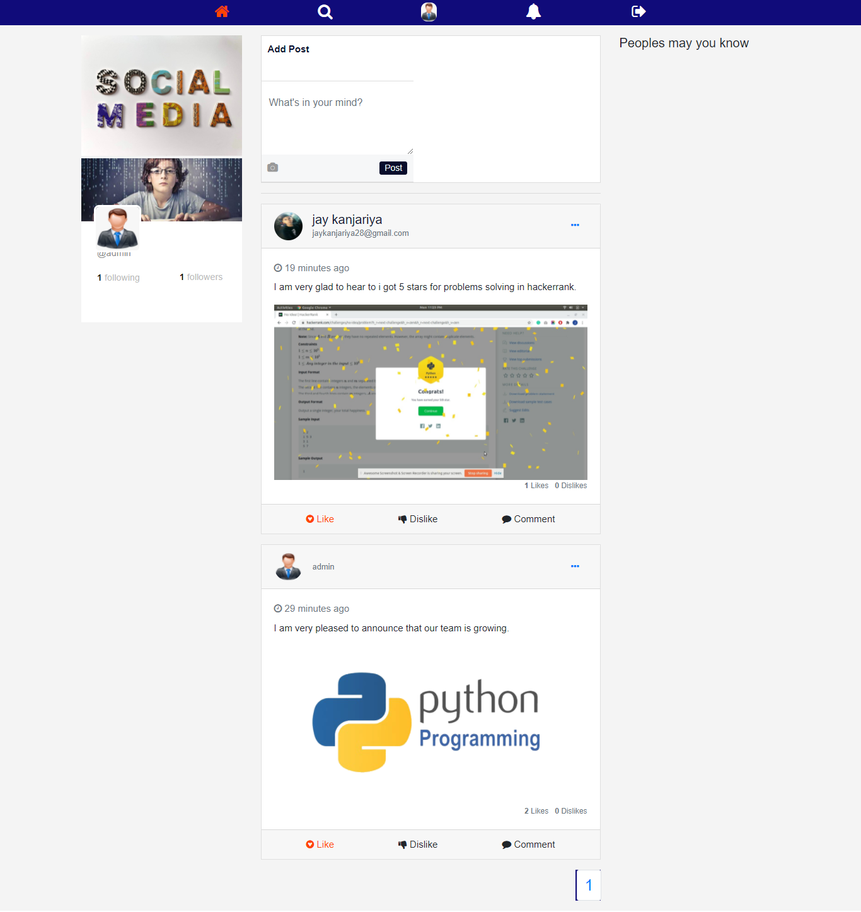
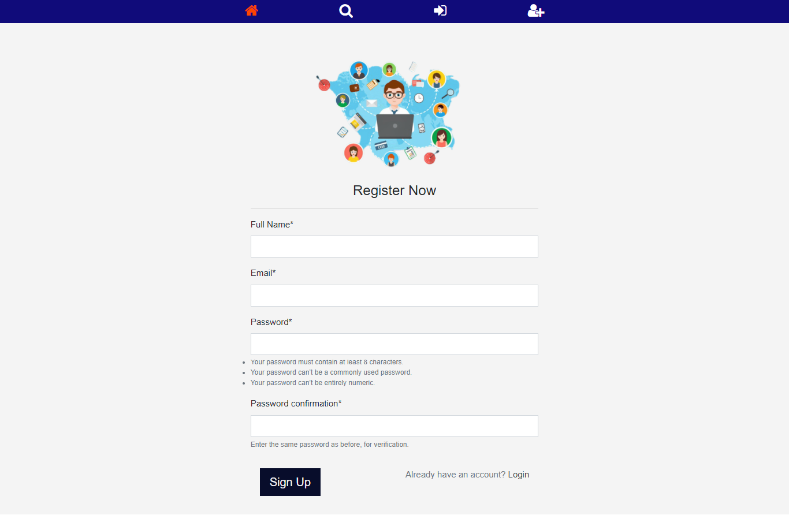
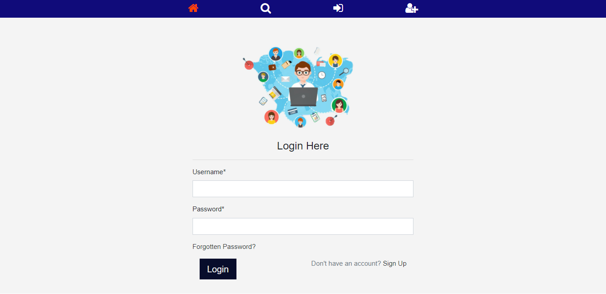
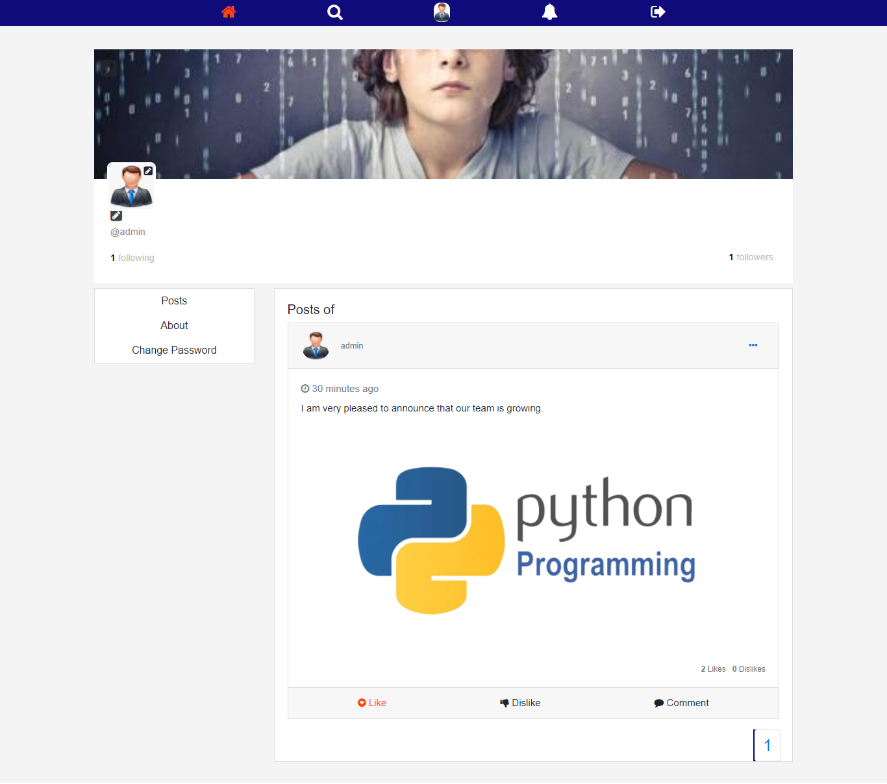

# Django-Social-Media-Webapp

Social media is a collective term for websites and applications that focus on communication, community-based input, interaction, content-sharing and collaboration.

## Project Overview

  * Made fully project with pure Django & JavaScript.

  * Any user need to do first create an account for use to socila media webapp. They will recive OPT for user email verification.

  * After creating an account they will create a profile, send requests to friends, upload posts, like & comment posts, and etc.

## Why Use The Social Media Webapp

  * The term social media refers to a computer-based technology that facilitates the sharing of ideas, thoughts, and information through virtual networks and communities.

  * Social media is internet-based and gives users quick electronic communication of content, such as personal information, documents, videos, and photos
  
  * Users engage with social media via a computer, tablet, or smartphone via web-based software or applications.

  * The power of social media is the ability to connect and share information with anyone on Earth, or with many people simultaneously.

  * People use social media to stay in touch and interact with friends, family and various communities.

## Project View
  
  1. Home Page
  
  
  
  2. SignUp Page
  
  
  
  3. Login Page
  
  
  
  4. Profile Page
  
  

## Technical Features

  ### `Models`
  
  ### `Admin Site`
  
  ### `CRUD Operations`
  
  ### `Passord Hashing`
  
  ### `Authorization`
  
  ### `Authentication`
  
  ### `Account Verify by OTP`
  
  ### `Session Handling`
  
  ### `csrf_token`
  
  ### `Django Query`
  
  ### `Template Language`
  
  ### `Image uploading`
  
  ### `Making uerie`
  
  ### `Middleware`
  
  ### `Filter`
  
  
## Learn More

  You can learn more in the [django documention](https://docs.djangoproject.com/en/3.2/).

  To learn Django Rest Framework, check out the [React documentation](https://www.django-rest-framework.org/).
